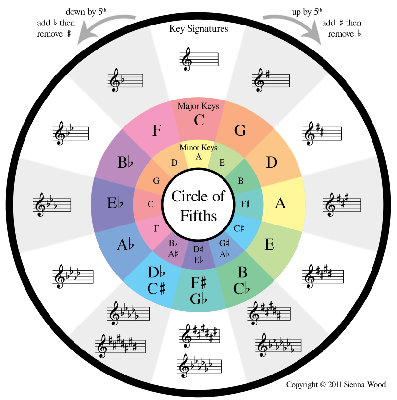

# Circle of fifths

The circle of fifths is a useful compositional tool that can be used in many different ways.

There are several properties of the circle of fifths, but you can try figuring out some of them from the image below.

Going right, you are going up by perfect fifths, and going left, you're going up in fourths.

---

What can this be used for?

Mainly, it's a compositional device as stated earlier. If you use this during music composition, you can find out which (diatonic, meaning in the key) chords belong in a key signature. Say you're writing something in C major, the diatonic chords would be C, F, G (C and the chords adjacent to it), and the relative minors of the chords stated earlier, which are written directly below the chords (Am, Dm, Em). Those would be the chords you would want to use in a piece assuming you wanted to stay in the key. Ignore Bm(b5) for now, that chord is very hard to use (and is basically G7 without the root note). The diminished chord in the key will be very hard to use at IGCSE level unless you practice/try finding when it sounds good by ear.

---

So basically, use it to find out what chords you could use in a song, it's not really useful for anything else :P
