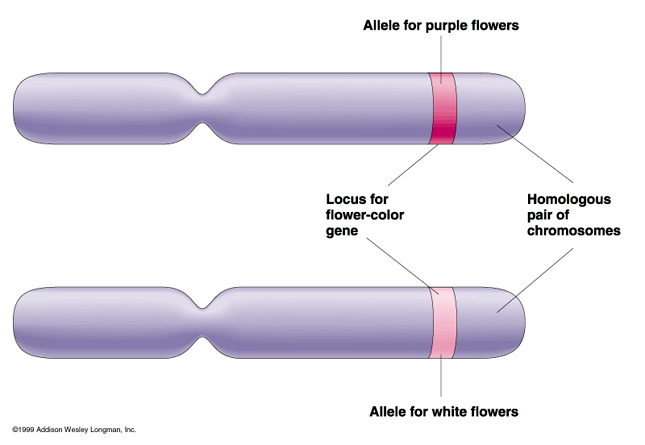

# Chromosomes, Genes, DNA and Alleles

> **3.14**   understand that the genome is the entire DNA of an organism and that a gene is a section of a molecule of DNA that codes for a specific protein
>
> **3.15**   understand that the nucleus of a cell contains chromosomes on which genes are located
>
> **3.19**   understand how genes exist in alternative forms called alleles which give rise to differences in inherited characteristics

---

#### Genome

> **3.14**   understand that the genome is the entire DNA of an organism and that a gene is a section of a molecule of DNA that codes for a specific protein

**Gene:** Coded instruction of how to make a specific protein (Done with the RNA and the ribosome and mRNA)

The genes (and chromosomes) can be found in the nucleus.

In *sexually reproducing* organisms, Chromosomes will be found in matched pairs. (i.e. one derived from each parent (homozygous and heterozygous))

---

**The same gene can come in different forms (which are called alleles)**

Various combinations of alleles cause differences in inherited characteristics

In the example above, we have the same gene for the same flower, but they are coloured differently because the allele is different.

**Genome:** Sum total of chromosomes for your whole body (unique to an individual (genetically unique))

---

> **3.15**   understand that the nucleus of a cell contains chromosomes on which genes are located
