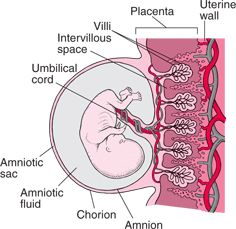

# Placenta

---

> **3.11** - describe the role of the placenta in the nutrition of the developing embryo
>
> **3.12** - understand how the developing embryo is protected by amniotic fluid

---

Basically is similar to the 'yolk' in the egg - it gives nutrition to the baby (who is basically drowned and is unable to breathe at all inside the body)

The umbilical cord connects the fetus to the placenta.

---

> **How does a developing embryo get its food and oxygen and get rid of waste?**
>
> It grows fingerlike projections or villi into the uterus lining. This eventually forms a plate like structure called a placenta. The umbilical cord joins the fetus to the placenta. The cord contains an artery and a vein that take the fetus blood to the placenta and back again

---

> **In the placenta the blood of the fetus flows close to the mothers blood but never joins. Why?**
>
> the mothers blood is flowing under high pressure. Also their blood types may be different and MUST not break. After a while the fetus becomes surrounded by a membrane called an amnion. It contains a fluid (amniotic fluid) that cushions the fetus and stops it being bumped.

---

The blood vessels are in contact with each other, but then the blood itself will not mix (because some blood types are incompatible with others). This will allow soluble materials to pass from the mother to the baby.

---

# Amnion & Amniotic Fluid

The **amnion** is the membrane that encloses the amniotic fluid - This is kind of 'ruptured' just before birth.

The **amniotic fluid** is a fluid that acts as a layer of cushion and protects the baby from mechanical (physical) bumps from the mum, drying out, and also helps with temperature regulation and fluctuation.

Some of the fetus cells could fall in the amniotic fluid. This could be used to analyze the baby (after birth) for any genetic defects/abnormalities, disease etc. This process is called **amniocentesis**
