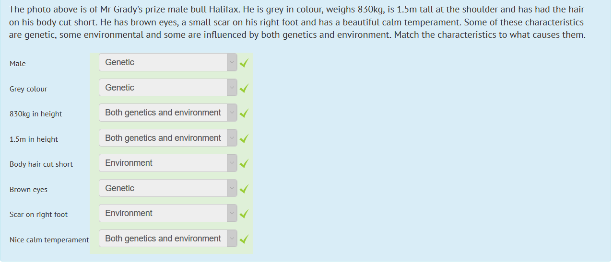

# Variation

> 3.31   understand how random fertilisation produces genetic variation of offspring
>
> 3.33   understand that variation within a species can be genetic, environmental, or a combination of both

---

Variation of a species can be genetic or environmental.

There is genetic difference between every person (and also identical twins, even though they come from the same egg)

You need to know that random fertilization produces **genetic variation** of offspring, and that some variation within a species can be genetic, environmental, or both.

Look above to see how it works in general.

---

- Gametes / sex cells are genetically unique through meiosis.
- Zygotes/offspring are also genetically unique.
- (Show some variation as a result of genetic differences (eg blood group))

# Mutation

> **3.34** understand that mutation is a rare, random change in genetic material that can be inherited

Ordinarily, mutations are deleterious (have a negative effect)

Mutations are rare (and random)

Many are neutral (don't do anything), some are negative, and some are positive.

There are two different types of mutations:

- Gene mutation
  - At the very small level (DNA/RNA)
    - Insertion / Deletion
- Chromosome mutation
  - Where possibly the chromosomes are messed up (ie reversed, deletion, insertion etc)
