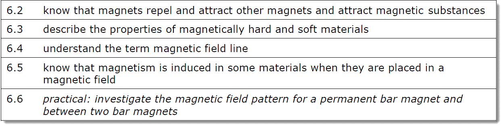
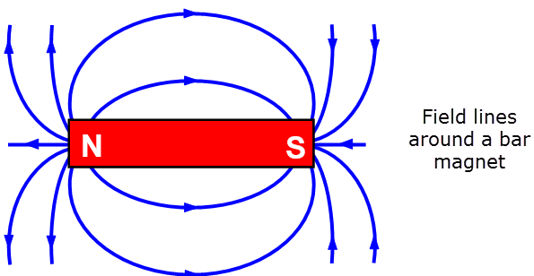
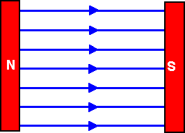
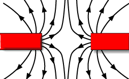
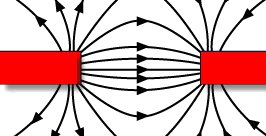

# Magnets

---

> North (Seeking Pole) - Looks for North (Pole)
>
> South (Seeking Pole) - Looks for South (Pole)

---

Difference between geographic poles and magnetic poles:

- Magnetic North will always point to geographic North Pole
- Magnetic South will always point to geographic South Pole

---

> If we look at the picture above, we can see that the arrows always go from north to south. (This is important for electromagnetism)
>
> The direction is made up, similar to conventional current in electricity. This is done to make calculations easier.

---

> Looking at this, arrow is drawn from north to south again
>
> If the lines are parallel and the arrows are of equal size, the field is uniform (which means that it is of equal strength at all points during the poles)
>
> Looking above, you can see that the bar magnet
---

When the lines are close together, the field strength is stronger (always closer to the poles)

---

**Remember, field lines never cross or collide ever**

---

If you put like magnets together, you can see that the lines kinda repel each other. If we look at the middle of the large gap, the field strength is 0 (because the forces from the two magnets cancel each other out) We call this repulsion

---

However, if you put similar magnets together, you get the field lines connecting from one to the other.

If the magnets are close to each other, the lines become parallel (meaning it's a uniform field woah!)

We call this attraction.

---

> **The magnetic materials are:**
>
> - Iron
> - Aluminum
> - Nickel
> - Cobalt

---

Magnetically Soft vs Magnetically Hard

> **Magnetically Soft**
>
> This means that it will lose its magnetism very quickly (iron is an example)

> **Magnetically Hard**
>
> This means that it will keep its magnetism for a long time (Steel is an example)

---
