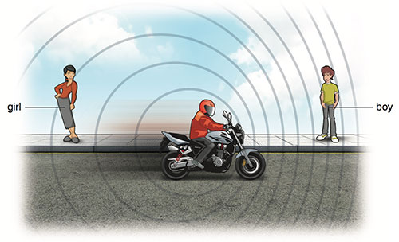

# The Doppler Effect

> When the source of waves, such as sound waves, moves towards or away from an observer, there is a change in its observed frequency.

---

> Looking at the wave length, if the bike is moving towards you (aka the boy), the wave length is lower. On the other hand, if the bike is moving away from you, the wave length gets longer. (Lower wave length = higher frequency, therefore higher pitch)

If you hear a police car or an ambulance with its siren sounding, you will notice that when the source of sound is coming towards you it has a higher frequency (pitch) than when it is going away from you. This effect is called the Doppler effect, and the change in frequency is called the Doppler shift.

---

All waves demonstrate the Doppler effect when the source is moving relative (towards or away from) the observer, but the effect is less obvious when the speed of the source is very small compared with the speed of the wave.

---

[Further Link - BBC](https://www.bbc.com/bitesize/guides/zphppv4/revision/1)
