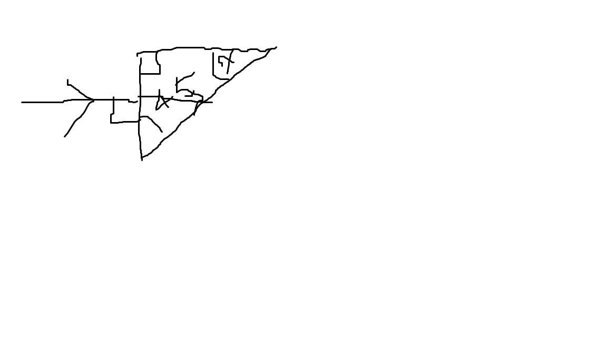
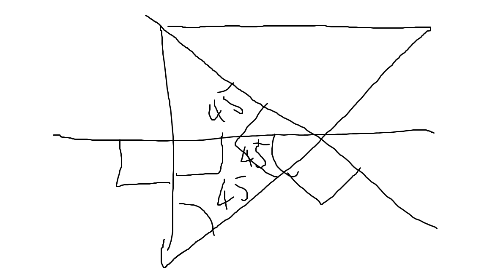

# Total Internal Reflection

When the incident angle is less than the critical angle, then the refraction index will be sin(i)/sin(r).

When the incident angle is more than the critical angle, then the incident angle will be equal to the reflection angle.

When the incident angle is the critical angle, we can find the refraction index by sini/sinr (where sini is 90, which is equal to 1). Therefore, we can deduce `n = 1/sinc` (c is the critical angle)

---

Air -> substance

substance refraction index is 1.33

How do we find the critical angle?

1.33 = 1/sinc

sinc = 1/1.33

c = sin^-1(1/1.33)

c = 48.8

---

Air -> substance

critical angle is 33

n = 1/sin33

n = 1.84

---

Will the observer see a triangle or a square?

First, find the critical angle (n = 1.3)

1.3 = 1/sinc

c = sin^-1(1/1.3)
c = 50.3

the observing angle is less than the critical angle, so it isn't total internal reflection yet, so it will refract instead of reflect.

---

n = 1.2

will the ray be reflected or refracted?

first, find the critical angle.

c = sin^1(1/1.2)
c = 56.44

Now, find the normal. The normal would make the reflected ray the same as the incident ray, which means the incident angle would be 45 (between the critical angle and the incident ray), which means that the final would be refracted out instead of reflected in.

There is another way to figure it out.

messy, but you get the point maybe.

---

> The higher the refractive index, the more optically dense the medium is. The refractive index must be higher than 1.
>
> Light moves faster in less optically dense mediums.

---
