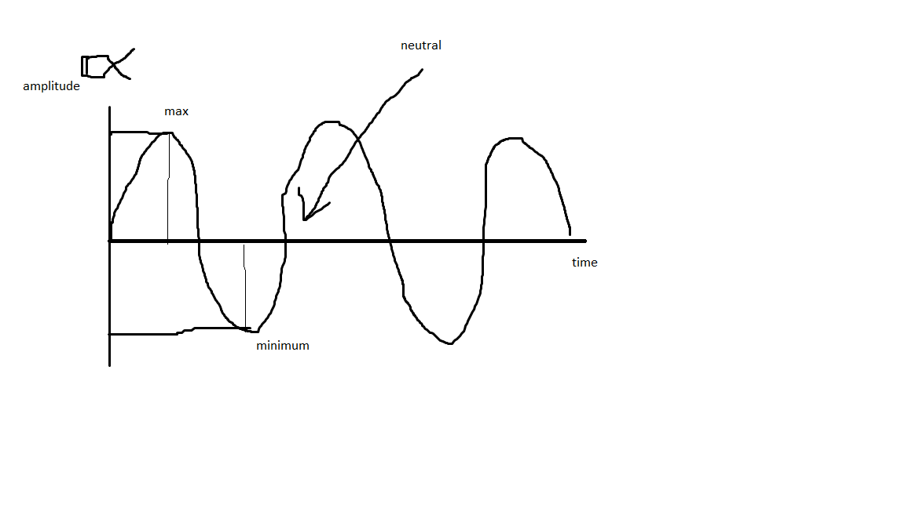
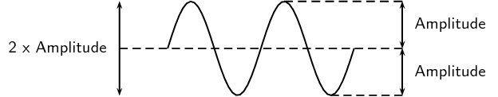

# Waves

#### Types of waves

- Longitudinal Waves
  - Sound
  - Earthquakes

- Transverse Waves
  - Sea Waves
  - Light

---

**Longitudinal:** Particles move parallel to the wave direction

**Transverse:** Particles move perpendicular to the wave direction

**Amplitude(A):** Max or min displacement from neutral point (has no unit, there are many units for different types of waves)

**Period of the wave(T):** Time it takes for a complete wave to go past a point (on the graph below, the x axis is time, so the gap between each maximum kinda suggests how long it takes for the wave to hit the minimum.)

**Frequency(F):** Number of waves going past a point every second (Hz) - measured basically the same way as the Period of the wave.

**Length of the wave(λ):** Distance between two reoccurring points on a wave (eg maximum/maximum or minimum/minimum). Measured in meters.

**Wave speed:** Speed that the wave travels.

---

#### Descriptors of waves

---

#### Simple Conversion for Frequency - Period of the wave

Frequency = 1/Period of the Wave

Period of the wave = 1/Frequency

> For example, if you had a wave crash the shore once every 10 seconds, the frequency of the wave would be 1/10 which is 0.1 Hz
>
> To convert the frequency of the moon from the period of the moon, you need to convert 28 days into seconds (2419200). Then after that, you find the reciprocal which is 1/2419200

Wave speed = frequency*waveLength

v=fλ

---

Instead of putting time on the x axis, you could simply put 'x', which means **position**. So the distance between each maximum will give length instead of the period (So it would be length of the wave)

---

# Example Question

> Wave has a period of 2 minutes and a wave length of 10m. What is the speed of the wave in m/s?

- 2 minutes = 120 seconds
  - Frequency = 1/120 Hz
- Wave length = 10m
- 1/120 Hz * 10 = 1/12

> Therefore 1/12 m/s
>
> 0.08 m/s (3sf)
