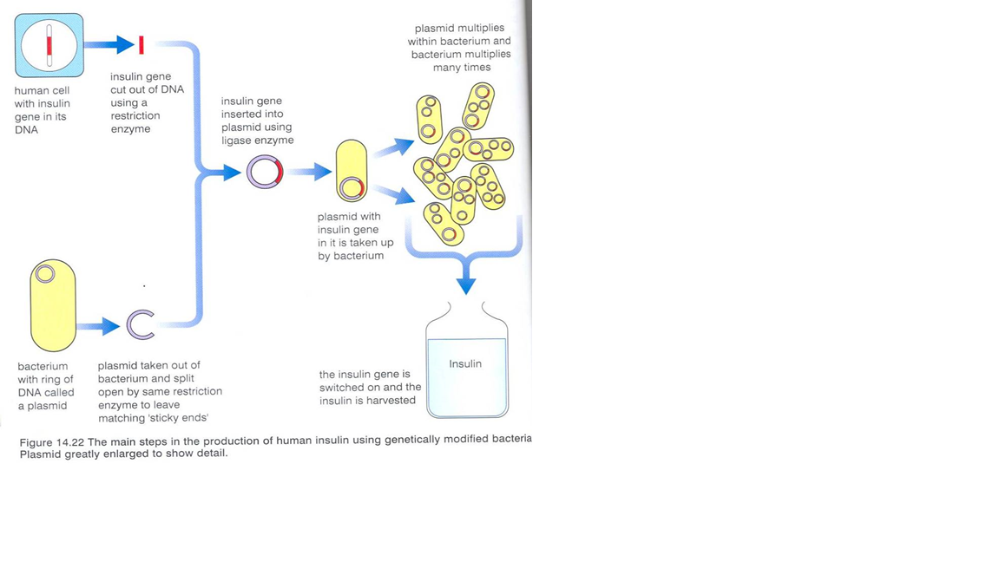
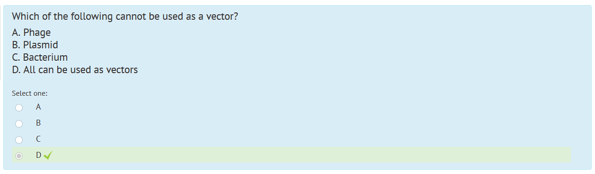

> **5.12** understand how restriction enzymes are used to cut DNA at specific sites and ligase enzymes are used to join pieces of DNA together
>
> **5.13** understand how plasmids and viruses can act as vectors, which take up pieces of DNA, and then insert this recombinant DNA into other cells
>
> **5.16** understand that the term transgenic means the transfer of genetic material from one species to a different species

---

**DNA is universal** (DNA stands for Deoxyribonucleic acid)

- The nature of the code and the way it works is the same in ALL ORGANISMS!
  - Controls the joining together of amino acids which form proteins in our cells.
  - Simply a bunch of instructions.

---

GMO's - Genetically Modified Organisms (organisms where their genes have been altered by genetic engineering)

TGO's = Transgenic Organisms (organisms where genes have been transferred from another)

---

With DNA, they have bases (AT/CG or in the RNA, AU/CG), these 'codes' are then taken to the RNA where they are read in sets of 3. These sets of 3 correspond to a different amino acids which get linked together to create a specific type of protein.

---

Modifying the genome of a species involves splicing and recombining DNA to allow the modified cells to synthesize, and make useful substances

---

**Gene transfer**

- This is where a section of DNA (a gene) is transferred from one living things chromosome to another's
- This can be done between the same or different types of living things
- One example is where the gene for producing insulin in humans is transferred to a bacteria.
- This is called genetic modification or genetic engineering.

---

**Bacteria has 2 types of chromosomes:**
- **Plasmids**
- **DNA (Chromosome)**

- Bacteria have 2 types of chromosomes. One of these is circular and is called a PLASMID.
- Scientists have found that bacteria can “swap” plasmids with other bacteria or even plants.

This makes these bacteria vectors (vectors transfer things) - These bacteria can be used to transfer genes/plasmids from one organism to another.

---

> Bits of bacterial plasmids can be “cut” with enzymes called restriction endonucleases. These “bits” of DNA are called recombinant DNA.
>
> New genes can be “glued” into them using other enzymes called ligases.

---

> Some viruses can also act as vectors.
>
> The process of removing a gene from one living thing and putting it into another is called GENETIC ENGINEERING

---

The Plasmid and gene is first extracted using a restriction enzyme, and then both have matching 'sticky ends', which are then combined with ligase enzyme. This plasmid with the new gene is then inserted into bacteria which rapidly reproduces. To even further improve the reproduction speed, they are put into a fermenter where they reproduce in large amounts. See the picture below.

---

Genetically modified plants:

Plants that are modified in the same way to have specific characteristics. For example, a plant could possibly have insect repelling genes that have been genetically modified.

What are possible disadvantages of doing this? What about the advantages other than the obvious?

---

Think of the disadvantages. Here are some as examples:

- Genetic Diversity
  - Plants may have an advantage over other and will essentially be predators.

etc - try thinking of more.

---

# Genetic Modification to Improve Food Production

> **5.15** understand how genetically modified plants can be used to improve food production

---

Essentially, selecting the best aspects of a plant and inserting them into a plant.

For example, cactus are very drought resistant, so if it is possible to find the gene responsible for that, then insert it into the intended plant (through genetic modification, look above)

**Risks**
- Unknown Consequences - we don't know if these have any long term disadvantages
- GMO can escape into wild and breed - possibly causing inbred plants. (For example, pollen from GM plant can go into stigma of non GM plant)
- Who benefits more?
  - Corporations?
  - Consumers?

(If you're asked to, make sure to give a balanced point of view.)

---

Phages can be used as a vector!!!
