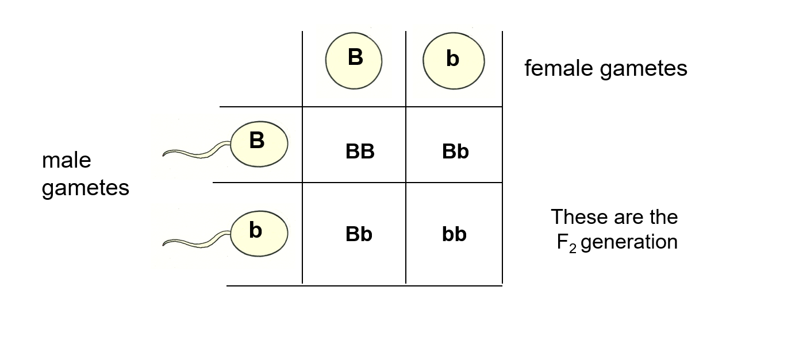
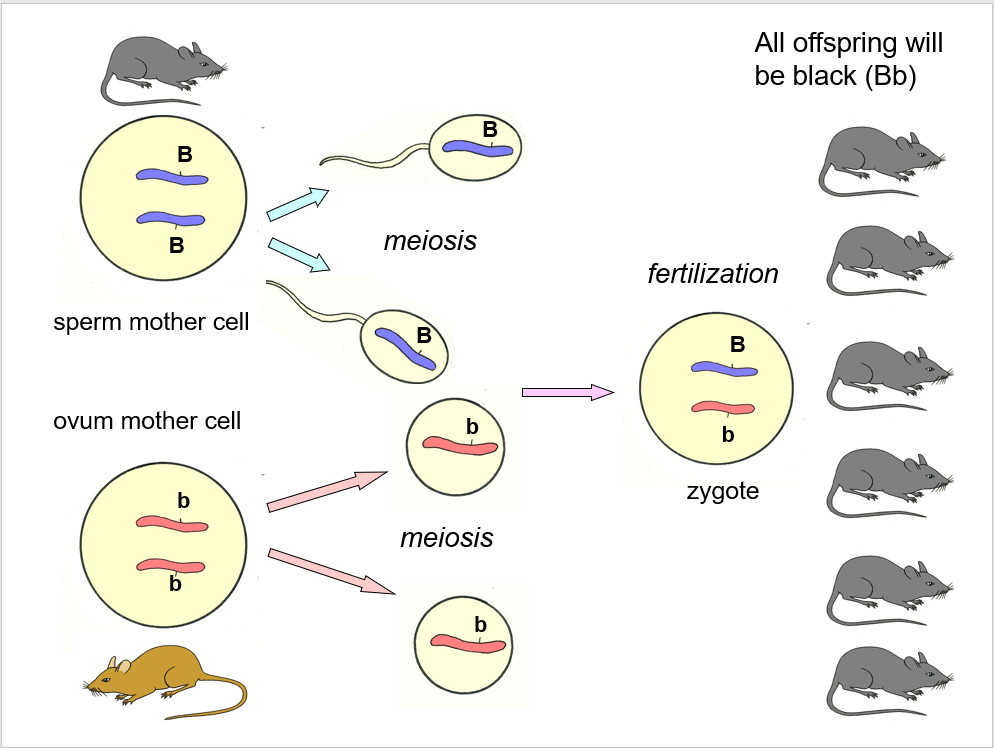
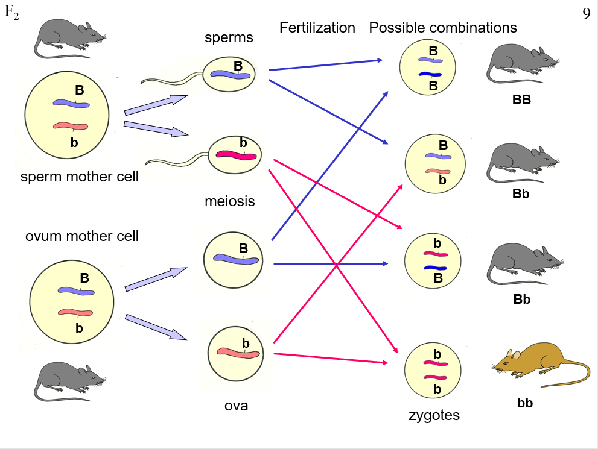
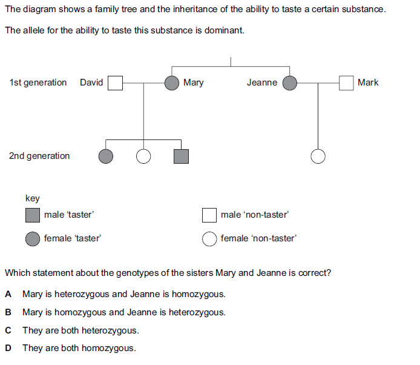

# DNA

> **3.20** understand the meaning of the terms: dominant, recessive, homozygous, heterozygous, phenotype, and genotype
>
> **3.21B** understand the meaning of the term codominance **(Triple Award ONLY)**
>
> **3.22** understand that most phenotypic features are the result of polygenic inheritance rather than single genes
>
> **3.23** describe patterns of monohybrid inheritance using a genetic diagram
>
> **3.24** understand how to interpret family pedigrees
>
> **3.25** predict probabilities of outcomes from monohybrid crosses
>
> **3.26** understand how the sex of a person is controlled by one pair of chromosomes, XX in a female and XY in a male
>
>**3.27** describe the determination of the sex of offspring at fertilisation, using a genetic diagram

---

Information:

- Genes contain the characteristics of living organisms

- Genes are carried on the chromosomes

- Chromosomes are in pairs, one from each parent

- Genes are in pairs

- Genes controlling the same characteristics occupy
identical positions on corresponding chromosomes

- DNA
  - The molecule that acts as genetic
- Chromosome
  - One DNA molecule and all the genes it carries
- Gene
  - A specific section of DNA that codes for one specific characteristic
- Allele
  - Different forms/versions of the same gene.

---

In sexually reproducing species diploid cells (2n, n being the haploid number) will contain:

- 2 Copies of each chromosome (one derived from each biological 'parent')
  - Therefore there are 2 copies of each gene
- These may be the same or different version.

---

Punnett Square:

**Capital Letter:** Dominant - the phenotype will be of this allele - ie if a gene has this allele, it will always have this physical characteristic

**Lowercase Letter:** Recessive - this phenotype will only appear if both of them are lowercase (will be explained more below)

**Homozygous (dominant/recessive):** Both are dominant or both are recessive

**Heterozygous:** There is one dominant allele and one recessive allele

**Genotype:** Pair of letters indicating 'genetic make-up' (ie TT or Tt or tt)

**Phenotype:** Physical trait

To remember homozygous or heterozygous, just think of homosexual or heterosexual ;)

Looking at this punnett grid, we can see that there are 2 possible phenotypes (one with a 3/4 chance and one with 1/4 chance).

For the first generation (pure, no cross breeding) - they will all have the same genotype and same phenotype (heterozygous)

For the second generation, both (hybrid) mice will be heterozygous, meaning that one of their genotypes will move on to the next generation, giving a 1/4 chance of homozygous dominant, 1/4 of homozygous recessive, and 1/2 for heterozygous.

---

# Example Questions

The gene for dark hair in humans is dominant over the gene for light hair. What are the possible outcomes if:

- A homozygous dark haired woman has a baby with a homozygous light headed man
  - HH or hh, will always be Hh
- A heterozygous dark headed woman has a baby with a homozygous light headed man
  - Hh and hh means Hh or hh 50% chance each
- A heterozygous dark headed woman has a baby with a heterozygous dark headed man
  - Hh and Hh means HH, Hh or hh, 25:50:25 ratio

We need to find the genotypes of Mary and Jeanne. First of all, we are told that the ability to taste this certain substance is dominant.

First, let's start with Jeanne.

Jeanne has a baby with Mark, somebody without the tasting genotype, which means that Mark will be homozygous recessive. At the same time, Jeanne has the phenotype for taster. The offspring is a non taster, which means for sure that Jeanne is Heterozygous (because that's the only combination that allows for a non-taster)

Mary is in the exact same situation. 2nd generation has tasters and non tasters, which guarantees heterozygous genetics.

---

# Inheritance of Sex

**NOT** gender, sexuality/sexual orientation.
Based on only genes.

> Primary Sexual characteristics; which reproductive organs? Derived genetically

Due to whole chromosomes and their associated genes

---

X chromosomes and Y chromosomes.

X chromosomes are far larger than Y chromosomes.

To have a female phenotype, you need the genotype of XX (homozygous recessive), and to have a male phenotype, you need a genotype of XY (heterozygous). This gives it a 50% for someone to be male or someone to be female (because Y is dominant, and the only gametes that can be produced from the female is X, so we can disregard that.)

Use a punnett square to find the probability if you're slow (but you need it for the exam so)
