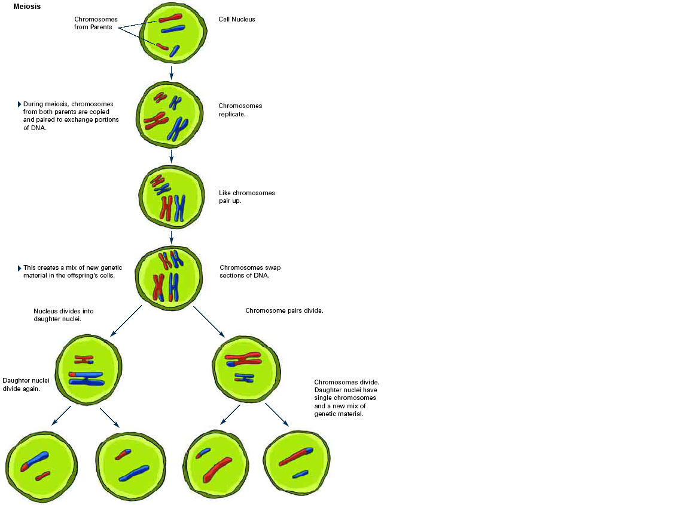

# Meiosis

> **3.30** - understand how division of a cell by meiosis produces four cells, each with half the number of chromosomes, and that this results in the formation of genetically different haploid gametes
>
>  **3.32** - know that in human cells the diploid number of chromosomes is 46 and the haploid number is 23

---

Example of Meiosis

During meiosis, chromosomes from both parents are copied then paired.

The process of meiosis occurs in the testes of males and the ovaries of females. It is a vital process in sexual reproduction.

The reason meiosis happens is to promote variation.

---

# Difference between Meiosis and Mitosis

| Meiosis | Mitosis |
| --- | --- |
| Promotes variation, better for varying environments | Makes an exact clone of the parent |
| Requires a mate to find to combine the male and female haploid cells | Does not require a mate to find, faster to find |
| Sexual Reproduction | Asexual Reproduction |
| Has 2 cell divisions | Has 1 cell division |
| Makes 4 daughter cells | Makes 2 daughter cells |
| Has half the chromosomes (so when they combine with the other gamete they will have the full number of chromosomes) | Has all the chromosomes for the species |
| Haploid Cell | Diploid Cell |

---

# Summary of Meiosis

- To make gametes a special type of cell division is used - meiosis.
- This process only occurs in the testes of males and the ovaries of females.
- In meiosis there are 2 divisions forming 4 new gametes
These new gametes only have half (haploid) the number of chromosomes in a normal cell.
- All the gametes produced are genetically different and therefore show variation.
- Therefore meiosis results in the production of 4 genetically different haploid gametes
