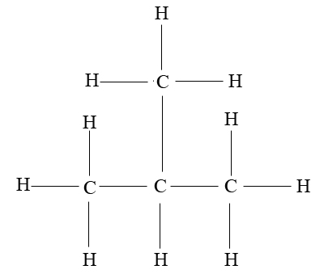

# Polymers

Polymers are monomers in 'chains' (monomers being alkenes such as ethene)

---

### Properties of a Polymer

---

# Isomers

> **Definition:** Same chemical formula but a different structural formula

'Important Terms':

- *Prefix* - methyl
  - Methyl is a word derived from methane, meaning that the isomer has 'methane' not part of the longest chain
  - Dimethyl - basically means two 'methanes' not in the longest chain.

---

Above is an image of Dimethylpropane, which is an isomer of Pentene. (5 Carbon atoms, 12 Hydrogen atoms). The longest carbon chain is 3 carbons long - therefore this isomer is a propane (3 carbon chain)

From the drawing above, the longest carbon chain (where the carbon starts to where the carbon ends) is 3, and the other remaining carbons are similar to methane.

---

Another example would be Methylpropane

This is an isomer of butane instead of pentane, but it is still a propane because the longest carbon chain is of length 3, and the remaining carbon forms a semi-methane structure.

This is called methylpropane (even though this is an isomer of butane, not pentane like dimethylpropane)

---
