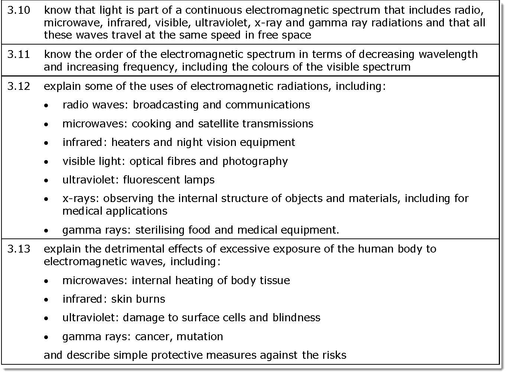
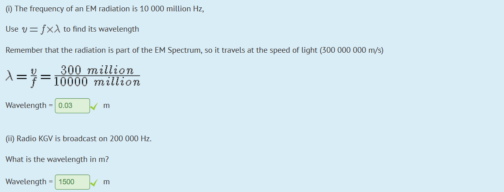

# Electromagnetic Spectrum

---

[Link to good resource](https://courses.lumenlearning.com/boundless-physics/chapter/the-electromagnetic-spectrum/)

---

---

---

### Radio Waves

AM and FM

- They stand for Amplitude Modulation and Frequency Modulation, that's how words are made out from radio waves. The frequency/amplitude will change and the radio will detect the changes and make it into audible words that can be heard from humans.

**Used mainly for Broadcasting and Communications**

---

### AM

---

### FM

---

### Microwaves

**Used for cooking and satellite transmission (mobile phone) + radar**

Excessive exposure may cause internal heating of body tissue

---

### Infrared

**Used for heaters and night vision equipment**

Everything that is warm(er than absolute 0) will give off infrared radiation

May cause skin burns when exposed to the human body in excess

---

### Visible Light

Used to see (and photograph)

---

### Ultraviolet

- Fluorescent lamps
- Fluorescent
  - Some substances absorb UV and reemit it in the visible spectrum

May damage surface cells and may cause blindness (ie skin cancer)

The retina at the back of the eye can go sunburnt

---

### X-Ray

**Observes the internal structure of objects and materials, including for medical applications**

May cause cancer because it is ionizing

> X-ray photons carry enough energy to ionize atoms and disrupt molecular bonds. This makes it a type of ionizing radiation and thereby harmful to living tissue. A very high radiation dose over a short amount of time causes radiation sickness, while lower doses can give an increased risk of radiation-induced cancer. In medical imaging this increased cancer risk is generally greatly outweighed by the benefits of the examination. The ionizing capability of X-rays can be utilized in cancer treatment to kill malignant cells using radiation therapy. It is also used for material characterization using X-ray spectroscopy.

Due to their penetrating ability, hard X-rays are widely used to image the inside of objects (e.g., in medical radiography and airport security).

> In medical diagnostic applications, the low energy (soft) X-rays are unwanted, since they are totally absorbed by the body, increasing the radiation dose without contributing to the image. Hence, a thin metal sheet, often of aluminum, called an X-ray filter, is usually placed over the window of the X-ray tube, absorbing the low energy part in the spectrum. This is called hardening the beam since it shifts the center of the spectrum towards higher energy (or harder) X-rays.

- X-rays have shorter wavelengths (higher energy ) than UV waves and, generally, longer wavelengths (lower energy) than gamma rays. Sometimes X-rays are called Röntgen radiation, after Wilhelm Röntgen, who is usually credited as their discoverer.
- Because X-rays have very high energy they are known as ionizing radiation and can harm living tissue. A very high radiation dose over a short amount of time causes radiation sickness, while lower doses can give an increased risk of radiation-induced cancer.
- Lower doses of X-ray radiation can be very effectively used in medical radiography and X-ray spectroscopy. In the case of medical radiography, the benefits of using X-rays for examination far outweighs the risk.
- X-rays are broken up into broad two categories: hard X-rays with energies above 5-10 keV (below 0.2-0.1 nm wavelength) and soft X-rays with energies 100 eV – 5 keV (10 – 0.1 nm wavelength). Hard X-rays are more useful for radiography because they pass through tissue.
- The distinction between X-rays and gamma rays is somewhat arbitrary and there is substantial overlap at the high energy boundary. However, in general they are distinguished by their source, with gamma rays originating from the nucleus and X-rays from the electrons in the atom.

---

### Gamma Rays

**Sterilizing food and medical equipment as well as stopping brain tumors**

May cause cancer/mutation

- Gamma rays are the highest energy EM radiation and typically have energies greater than 100 keV, frequencies greater than 1019 Hz, and wavelengths less than 10 picometers
- Gamma rays from radioactive decay are defined as gamma rays no matter what their energy, so that there is no lower limit to gamma energy derived from radioactive decay. Gamma decay commonly produces energies of a few hundred keV, and almost always less than 10 MeV
- Gamma rays have characteristics identical to X-rays of the same frequency—they differ only in source. Gamma rays are usually distinguished by their origin: X-rays are emitted by definition by electrons outside the nucleus, while gamma rays are emitted by the nucleus.
- Natural sources of gamma rays include gamma decay from naturally occurring radioisotopes such as potassium-40, and also as a secondary radiation from atmospheric interactions with cosmic ray particles. Exotic astrophysical processes will also produce gamma rays.
- Gamma rays are ionizing radiation and are thus biologically hazardous. The most biological damaging forms of gamma radiation occur at energies between 3 and 10 MeV.

---
