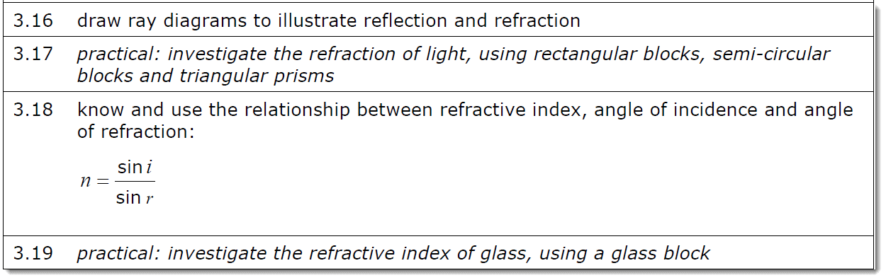
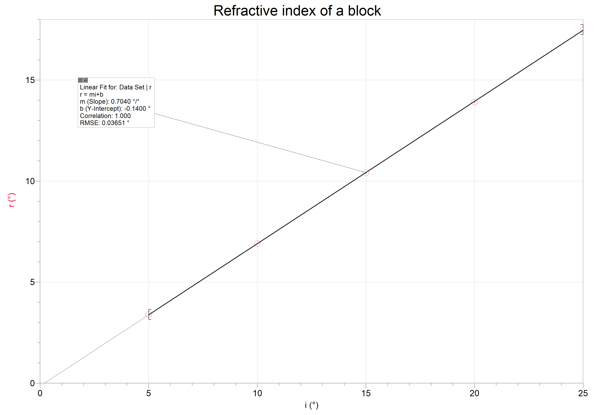
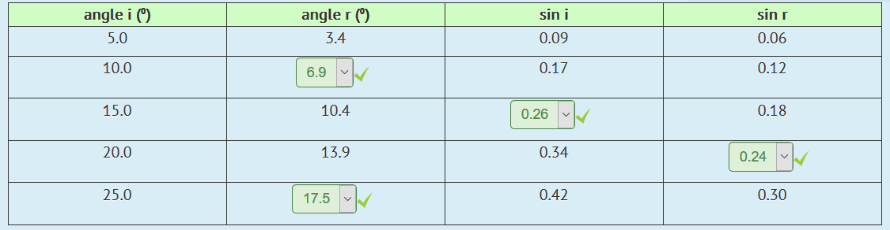
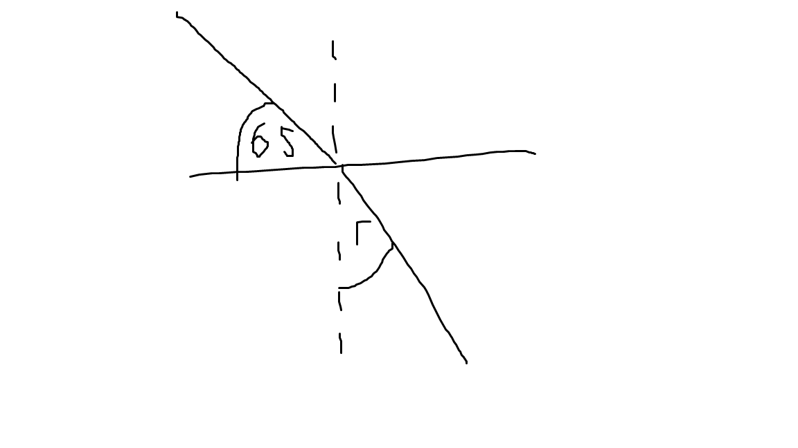

# Refraction

---

Looking at the graph above, we can see that the graph is linear. The constant between the two (gradient) is the refraction index (Snell's Law)

Snell's Law (For Refraction Index):

n = sin(i)/sin(r)

where i is the incident angle and r is the refracted angle

N is a constant, which is called the refractive index. (Check syllabus statement for more clarity.)

---

n will always be greater than 1.

The refractive index of water is 1.3 (n = 1.3)

---

# Example Question

Here, we need to find the value of r

First, we need to find the value of i. We were given the complement of i, and not i itself. i would be 90-65 = 25

then now, use the equation above to find r given that 1.3 is n.

1.3 = sin(25)/sin(r)

sin(25)/1.3 = sin(r)

sin^-1(sin(25)/1.3) = r

---

After the critical angle (where sin r = 90 therefore 1), anything is reflected back which is called the total internal reflection.
