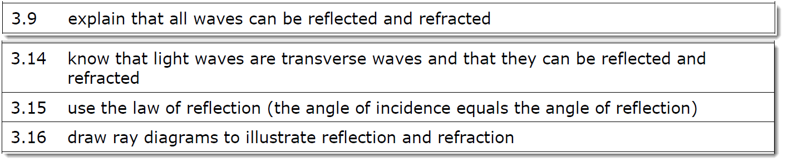
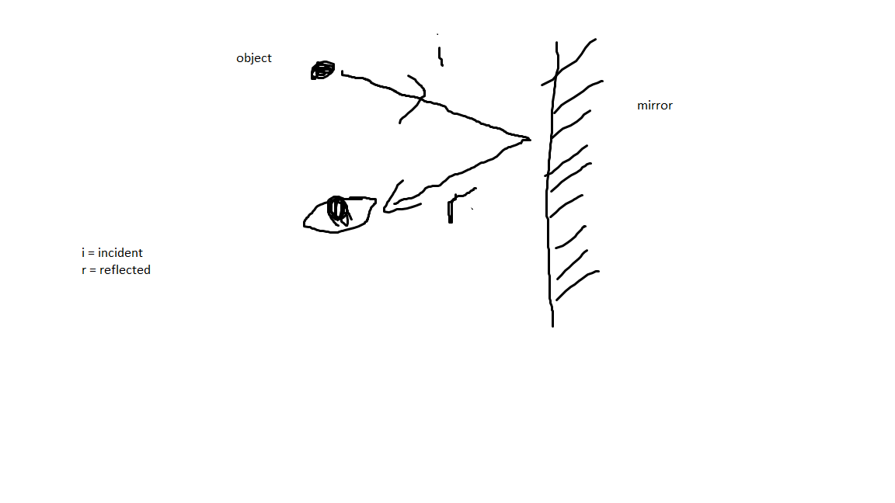
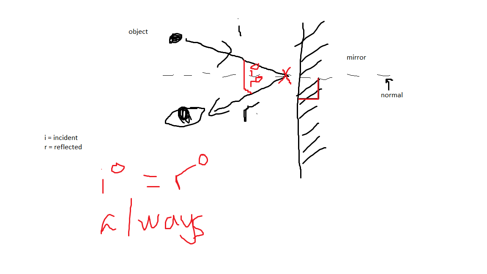
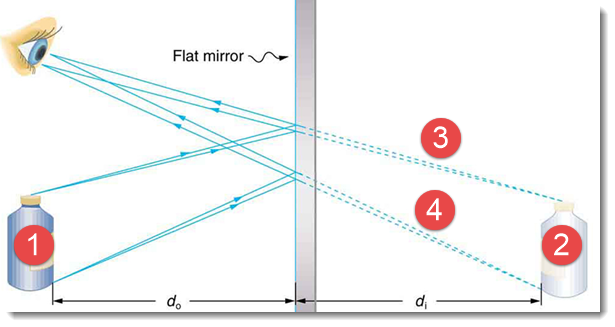
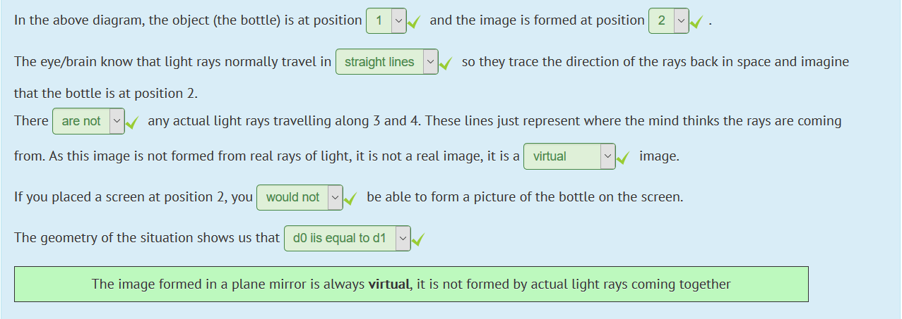

# Waves

---

Amplitude is always measured from the neutral to the maximum displacement (from neutral)

Speed of the wave = Frequency * Length of the wave

If waves encounter a surface, it will bounce off the surface (ie reflect)

How does a mirror work?

We can predict the reflected ray of light. All angles measured from the normal angle. The incident angle is always equal to the reflected angle.  i = r

In the picture above, the **normal** is an imaginary line (perpendicular to the plane of reflection). The incident ray's angle will always be the same as the reflection ray's image given that the normal is perpendicular to the plane and goes through the point of intersection between the two rays (red x in the diagram)

---

Law of reflection: Angle r = Angle i

---

Notice how 2 is perpendicular to 1 - will appear to be in exactly the same point beyond the mirror.

3 and 4 are not real, the image is virtual (not real, kinda like how threads are not real cores) - appears to be beyond the mirror, not a reflection.

2 is laterally inverted - ie inverted sideways so right becomes left depending on perspective

